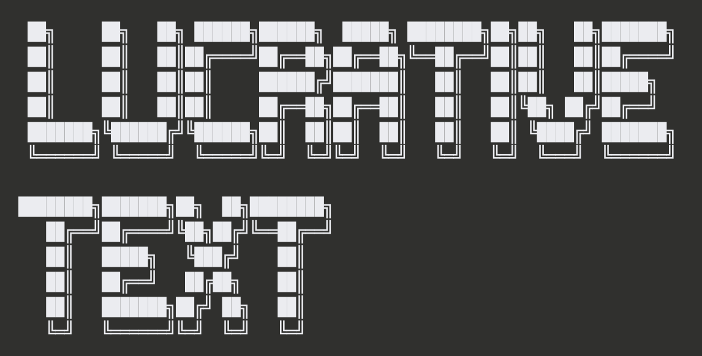
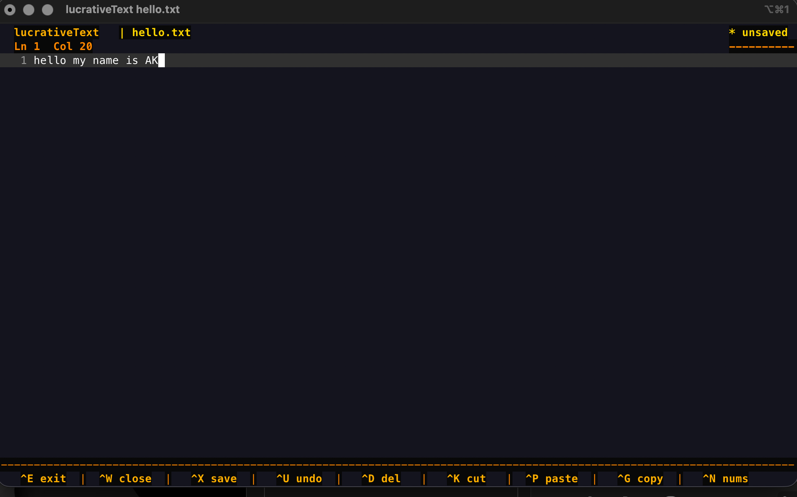
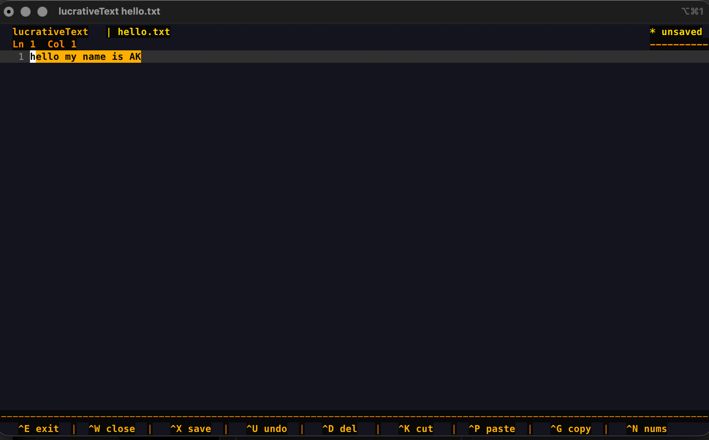
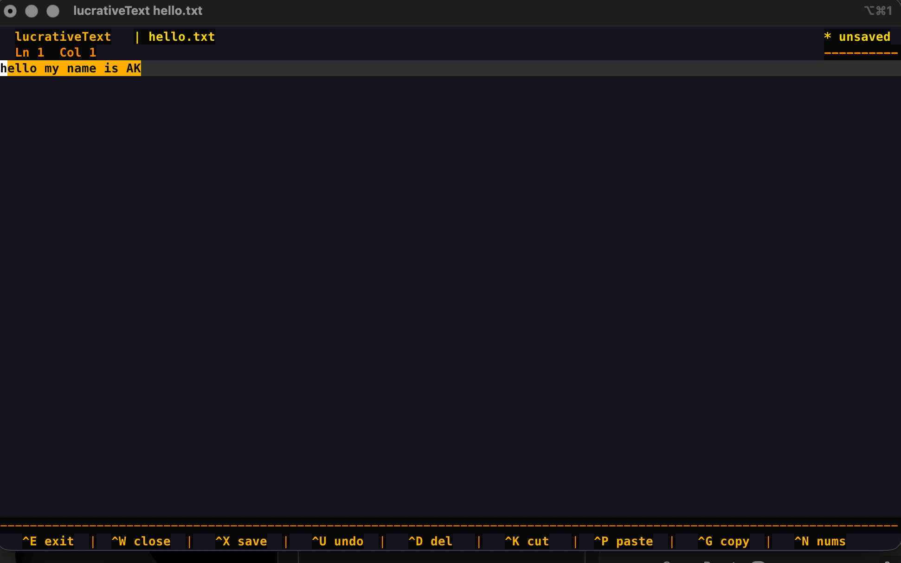

# lucrativeText

A fast, lightweight terminal text editor for Linux and macOS — built in C with ncurses.



---

## Screenshots

### Editor view



### Selection highlight



### Line numbers toggle



---

## Installation

### Homebrew (macOS + Linux) — recommended

```bash
brew tap YOURUSERNAME/lucrativeText
brew install lucrativeText
```

### Build from source

```bash
git clone https://github.com/YOURUSERNAME/lucrativeText
cd lucrativeText
make install
```

**Dependencies:**

- macOS — nothing extra, ncurses ships with the OS
- Linux (Debian/Ubuntu) — `sudo apt install libncurses-dev`
- Linux (Fedora/RHEL) — `sudo dnf install ncurses-devel`
- Linux (Arch) — `sudo pacman -S ncurses`

---

## Updating

### Homebrew

```bash
brew update
brew upgrade lucrativeText
```

### Built from source

```bash
cd lucrativeText
git pull
make install
```

---

## Uninstalling

### Homebrew

```bash
brew uninstall lucrativeText
brew untap YOURUSERNAME/lucrativeText
```

### Built from source

```bash
cd lucrativeText
make uninstall
```

---

## Usage

```bash
lucrativeText myfile.c       # open a file
lucrativeText newfile.txt    # create a new file
lucrativeText --help         # show keybindings
lucrativeText --version      # show version
```

---

## Keybindings

| Key                 | Action                    |
| ------------------- | ------------------------- |
| `Ctrl+X`            | Save                      |
| `Ctrl+E`            | Exit                      |
| `Ctrl+W`            | Close without saving      |
| `Ctrl+U`            | Undo                      |
| `Ctrl+D`            | Delete current line       |
| `Ctrl+K`            | Cut line or selection     |
| `Ctrl+G`            | Copy selection            |
| `Ctrl+P`            | Paste                     |
| `Ctrl+N`            | Toggle line numbers       |
| `Shift+Arrow`       | Select text               |
| `Option+Left/Right` | Jump word by word         |
| `Tab`               | Indent 4 spaces           |
| `Shift+Tab`         | Unindent                  |
| `Home / End`        | Jump to start/end of line |
| `Page Up / Down`    | Scroll full page          |

---

## Features

- **Orange/amber theme** — easy on the eyes, modern terminal aesthetic
- **Fully dynamic buffer** — no hardcoded line or file size limits, handles any file
- **Undo history** — 128 snapshot undo stack
- **Selection** — shift+arrow highlight with cut, copy, paste
- **Auto-indent** — new lines match the indentation of the previous line
- **Current line highlight** — always know where your cursor is
- **Toggleable line numbers** — show or hide the gutter with Ctrl+N
- **Horizontal scrolling** — handles lines longer than your terminal width
- **Dirty flag** — header shows `* unsaved` when you have unsaved changes
- **Save feedback** — flashes confirmation after every save
- **2-row header + footer** — clean, spaced UI with all info visible at a glance

---

## Building

```bash
make            # compile only
make install    # compile and install to /usr/local/bin
make uninstall  # remove from /usr/local/bin
make clean      # remove compiled binary
```

---

## License

Licensed under [CC BY-NC 4.0](https://creativecommons.org/licenses/by-nc/4.0/).

Free for personal use. You may modify and share it freely.
Commercial use is not permitted — nobody should ever pay for this.

---

## Contributing

PRs welcome for bug fixes and improvements. Open an issue before working on big features so we can discuss first.

---

_Built with C and ncurses. No dependencies. No bloat._
